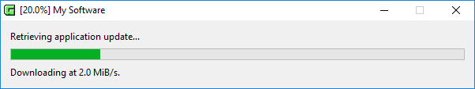

# trivrost

trivrost is a repurposable application-downloader and -launcher in the form of a native executable: it updates some files on a computer and executes a command afterwards, no questions asked. It can also update itself to introduce new features without the need for user interaction. One possible use case could be keeping an application (e.g. JARs) and its runtime (e.g. JRE) up to date without any additional client-side requirements. See [reasons.md](docs/reasons.md) for more background information.

## When do I need trivrost?
When you need to deploy an always-online desktop application which always needs to be up to date to many users using all three major OSs and all of them expect your software to *just work*.

## What does it look like?

## How does it work?
You release your own build of a trivrost executable to your users. The users start it, causing it to [install and run](docs/lifecycle.md) your software by downloading required files from a webserver administrated by you.

## State of this project
Production-ready, with high confidence for Linux and Windows builds. Has approximately 10.000 active Windows users for one of our builds. MacOS-support [needs input](https://github.com/setlog/trivrost/issues/11).

## Learn more
1. [Background info](docs/reasons.md)
1. [Glossary](docs/glossary.md)
1. [How to use trivrost (Start here)](docs/walkthrough.md)
1. [Lifecycle](docs/lifecycle.md)
1. [File locations](docs/file_locations.md)
1. [Building](docs/building.md)
1. [Launcher-config specification](docs/launcher-config.md)
1. [Deployment-config specification](docs/deployment-config.md)
1. [Bundle info specification](docs/bundleinfo.md)
1. [Security](docs/security.md)
1. [Command line reference](docs/cmdline.md)
1. [Troubleshooting](docs/troubleshooting.md)

## Contribute to development
See [CONTRIBUTING.md](CONTRIBUTING.md).
